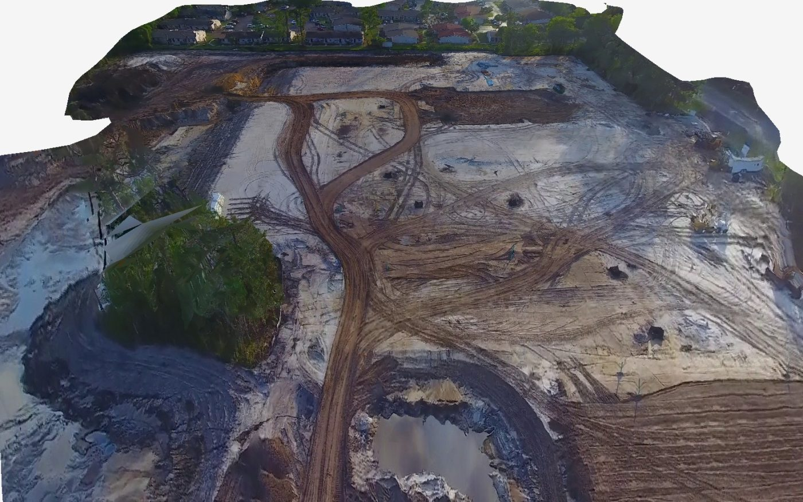
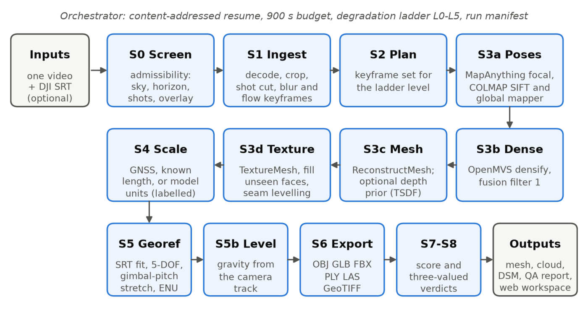
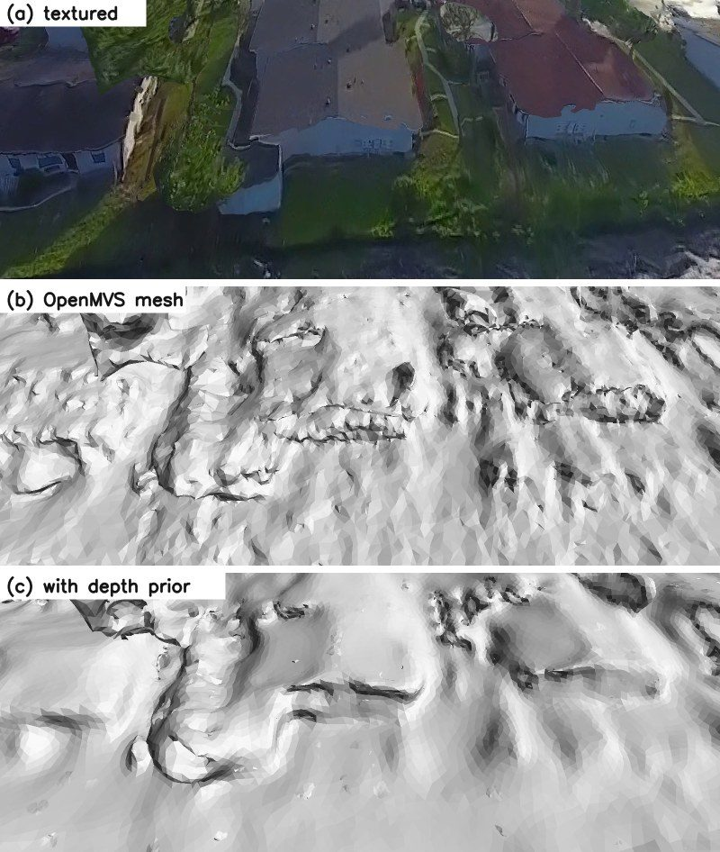
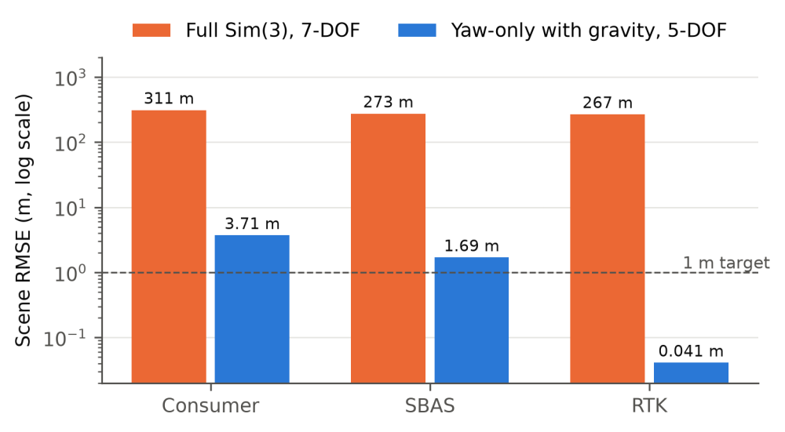
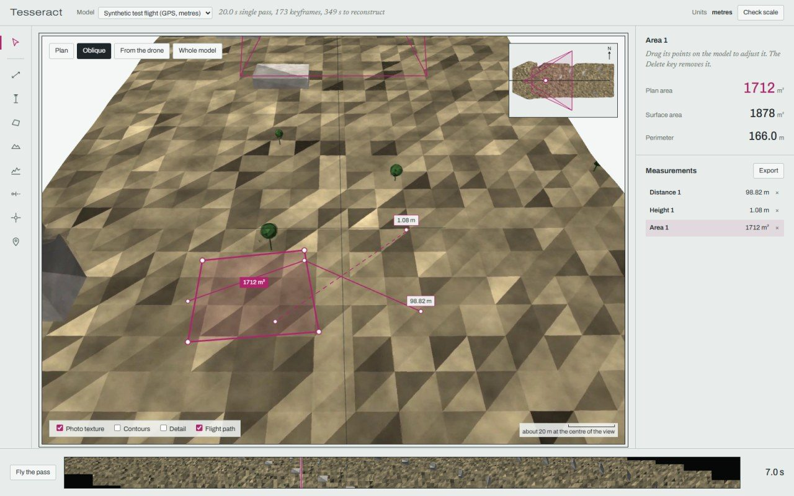
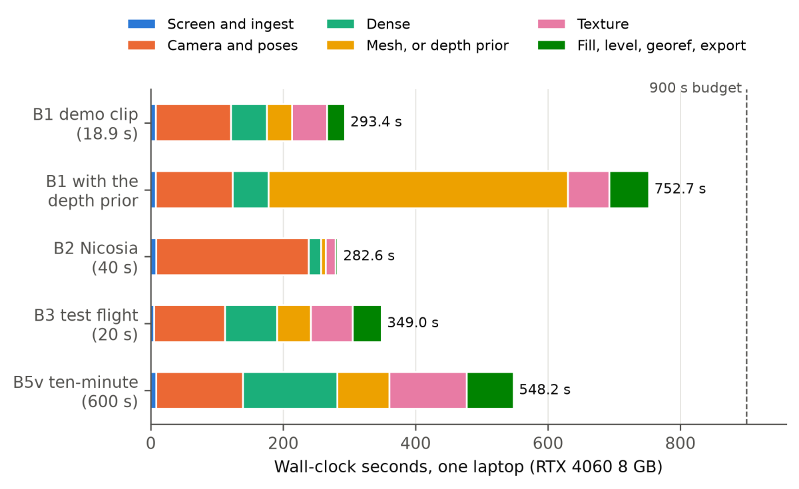

# Tesseract: single-pass drone video to a georeferenced 3D model

Smart India Hackathon 2026, problem statement **SIH26158** from the National Technical Research Organisation.

One drone video from one flight pass goes in. A textured 3D model comes out, in metres and on the map when the drone's GPS log is there, built on one laptop GPU inside the 15-minute budget.

**[Live site](https://tesseract-sih26158.vercel.app)** | **[3D workspace](https://tesseract-sih26158.vercel.app/workspace.html)** | **[Research paper (PDF)](paper/Tesseract-research-paper.pdf)**



*The 18.9 s demonstration clip as a textured model, seen from a viewpoint the drone never flew. Built in 293 s on an RTX 4060 laptop.*

## Results

| What was measured | Result |
|---|---|
| Demo clip (18.9 s, 177 keyframes), end to end | **293 s** |
| Held-out frames rendered from the model | **24.6 dB PSNR**, SSIM 0.71, 98.7% of pixels covered |
| Same views, MapAnything alone | 20.9 dB |
| Same views, COLMAP with OpenMVS | 18.7 dB, after more than 1,200 s |
| Ten-minute flight with DJI telemetry (synthetic, with truth), end to end | **548 s** of the 900 s budget |
| That flight's point cloud against the true surface | **0.344 m median**, 98.5% within 1 m |
| Export formats, each read back after writing | OBJ, GLB, FBX, PLY, LAS, GeoTIFF |

Held-out means every tenth keyframe is kept out of the build and the model is rendered into its camera. The ten-minute flight is synthetic because no real ten-minute clip with ground truth exists yet; the paper says what that does and doesn't prove.

## Against the problem statement's targets

| Target | Status |
|---|---|
| 3D mesh or point cloud | met |
| Under 15 min for a 10-min video | met on the synthetic ten-minute flight (548 s) |
| 1 m spatial accuracy | met on synthetic flights with gimbal pitch; not yet measured on real footage with surveyed ground |
| Entire visible scene | partly: 98.7% of held-out pixels on the demo; the back of any object is never seen by one pass |
| OBJ, PLY, LAS, GeoTIFF, glTF, FBX | met |
| Web or desktop viewer | met: the workspace above, with distance, height and area tools |

## How it works



- **Screen and ingest.** Each clip is checked for sky, horizon, shot cuts and overlays before any GPU time is spent. Keyframes are chosen from optical flow, and stretches the blur gates reject are bridged so the flight never has a hole.
- **Camera and poses.** MapAnything fits the camera's focal length, then COLMAP's global mapper solves the poses with that camera held fixed. This turned a layered, drifting model into one ground surface.
- **Surface and texture.** OpenMVS densifies, meshes and textures. Faces no photo saw are coloured from the dense cloud, and texture seams are levelled with our own implementation, because OpenMVS's blackens the atlas in the build we use.
- **Metres and map.** With a DJI SRT file the model is fitted to the GPS track with roll and pitch fixed from gravity, and the gimbal pitch corrects the focal length.
- **Honest output.** Every run writes a manifest, and a length is called a metre only when GPS or a known object supports it. Each target gets a verdict of met, not met or not measurable.

An optional **depth prior** (MapAnything depth, fused and remeshed) gives houses flat roofs and upright walls and trees a crown, where OpenMVS alone makes lumps. It adds about 460 s, so it's off by default; the site's demo model uses it.



## Why one pass is hard

We measured these on synthetic flights with known truth before building anything, and each one changed the design.

- **A straight pass is degenerate.** Camera centres on one line can't pin rotation about that line. A full similarity fit to GPS left the scene **311 m** off, and **267 m** off even with RTK. Fixing roll and pitch from gravity brought it to 0.041 m.

  

- **Consumer GPS has a floor.** About **4.1 m** absolute at any number of keyframes, because its bias doesn't average out; RTK reaches **0.097** m. End to end on a synthetic flight: 2.260 m with consumer GNSS, 0.098 m with RTK.
- **One pass sees few walls.** A nadir camera sees 14.3% of the along-track facades, one tilted 60 degrees sees 52.0%.
- **Heights hide traps.** Geoid separation in India runs from -24.3 m (Leh) to -98.2 m (Kanyakumari), EGM96 and EGM2008 differ by 1.68 m at Amritsar, and UTM carries about 0.6 m/km of scale error, so the fit is done in local ENU.
- **The obvious model is ruled out.** VGGT's licence forbids military and espionage use. MapAnything is Apache 2.0 and takes the camera and GPS as inputs.

## The workspace



Travel along the flight path and measure on the reconstructed surface. On a run with GPS, readings are in metres with the latitude and longitude of each point.

## Speed



## Run it

```bash
pip install -r requirements.txt
# COLMAP, OpenMVS and assimp (for FBX) are found through these; MapAnything runs offline once cached
export SIH_COLMAP=/path/to/colmap SIH_OPENMVS=/path/to/openmvs SIH_ASSIMP=/path/to/assimp HF_HUB_OFFLINE=1

python tesseract.py run clip.mp4 --geometry local --horizon crop --name demo   # a clip.SRT beside it is used automatically
python tesseract.py verify out/runs/demo
python tools/pack_site.py out/runs/demo --id b1 --title "Demo clip"            # then open web/workspace.html
```

Turn the depth prior on with `--config tools/repro/prior.json`. Every run behind the paper's tables is in [`tools/repro/`](tools/repro/README.md), with the numbers a rerun should match.

## Limits

- No real clip with surveyed ground yet, so the sub-metre figures come from synthetic flights.
- No real ten-minute 30 fps clip yet; its time (about 615 to 700 s) is predicted from measured stage rates.
- Most consumer DJI logs don't record gimbal pitch, and without it the height scale rests on MapAnything's focal length.

## More

- [`docs/00-start-here.md`](docs/00-start-here.md): the whole project in one document, with where every figure comes from
- [`paper/Tesseract-research-paper.pdf`](paper/Tesseract-research-paper.pdf): method, experiments, baselines and ablation
- [`web/README.md`](web/README.md): the site and the workspace
- [`docs/15-engineering-handbook.md`](docs/15-engineering-handbook.md): setup, commands and repo layout

Before the local GPU pipeline existed, an earlier run console was deployed at https://tesseract-demo.vercel.app/console/.

**Team Tesseract:** Kartik Shirode, Mandar Wagh, Aditya Shiralkar, Adityaraj Shinde, Jiya Mehta and Sanika Sagavkar.

The Nicosia footage is from Wikimedia Commons under CC BY 3.0 (The Track Record - BTS). MapAnything is used under Apache 2.0, COLMAP (BSD) and assimp (BSD 3-clause) as released, and OpenMVS (AGPL 3.0) unmodified as a separate process.
