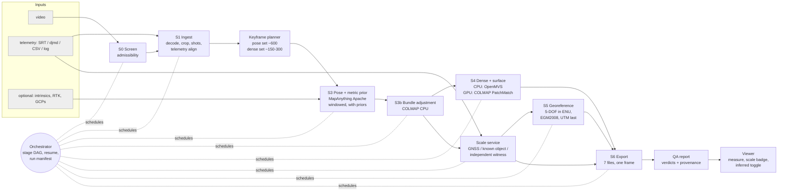
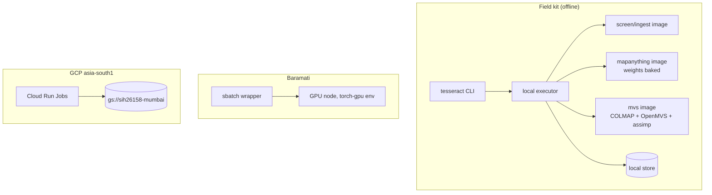

# Target architecture (v2)

Version 1.1 — 2026-09-18 (1.0: 2026-09-16). Where the system goes from the v1 design in
`docs/02` and the measured state in `docs/05`–`08`. It changes v1 in four places: a
**scale service**, a **stage-DAG orchestrator** with pluggable executors, **separate pose
and dense keyframe sets**, and a **GPU dense path** that is not a hard dependency.

> **Built 2026-09-18 as `src/tesseract/`.** The orchestrator, the contracts, the scale
> service, the levelling stage, the ladder, the QA report and the CLI are implemented and
> tested (44 checks, `python src/tesseract/test_tesseract.py`). §10 records exactly what
> is real, what is adopted from earlier runs, and what is still a design.

---

## 1. Where v1 stands

| Stage | Designed (`docs/02`) | Built | Measured on real footage |
|---|---|---|---|
| S0 Screen | — (added later) | ✅ `src/ingest/screen.py` | ✅ 4 clips (T-ROB-08) |
| S1 Ingest | decode, telemetry, keyframes, intrinsics | ✅ decode, crops, shots, keyframes; ⚠ SRT parsed but not aligned (GAP C-3) | ✅ Kolu, Village, Nicosia |
| S2 Masking | semantic + geometric | ⚠ geometric only, implicitly (MVS ≥ 3-view consistency) | ✗ |
| S3 Pose + prior | MapAnything, chunked, with priors | ✅ single window, **no priors** (GAP C-5); ✅ windowed stitching (synthetic) | ✅ 45 views, CPU and T4 |
| S3b BA | — (added by ADR-006) | ✅ COLMAP, CPU | ✅ 0.366 px |
| S4 Dense + surface | Poisson / TSDF | ✅ OpenMVS densify + Delaunay mesh; ⚠ texture fails | ✅ two clips |
| S5 Georef | robust 5-DOF, ENU → UTM, geoid | ✅ synthetic path | ✗ **no GNSS clip** |
| S6 Export | six formats + viewer | ✅ seven files, one frame | ✅ readback |
| Scale | implied by the model | ✗ | ✅ **found 5.5× off** (EXP-14) |

---

## 2. Principles

1. **Every stage is a pure function of its inputs.** Outputs are content-addressed, so any
   run resumes from any stage and a re-run with the same inputs does no work.
2. **Executors are replaceable.** The same DAG runs locally, on Slurm (Baramati) or on Cloud
   Run Jobs (`asia-south1`). No stage knows where it runs.
3. **GPU accelerates; nothing requires it** (ADR-011).
4. **Scale and georeference are evidence, not side effects.** A dedicated service owns them
   and writes the only files that may turn model units into metres (ADR-014).
5. **Always return something labelled.** A budget overrun or a stage failure moves down the
   ladder (§5); it never ends in nothing.

---

## 3. Components

### 3.1 What crosses each boundary

Formats and frames are in `docs/09`. In short:

| Edge | Payload | Frame |
|---|---|---|
| S1 → planner | keyframe candidates, per-frame sharpness and flow, telemetry | F0 |
| planner → S3 | pose set + priors | F0 / F1 |
| S3 → S3b | cameras, intrinsics, point maps, conf, mask, **per-view scale** | F3 |
| S3b → S4 | refined sparse model, **dense set** only | F4 |
| S3b → scale service | cameras, sparse points | F4 |
| scale service → S5 / S6 | `scale_calibration.json` | — |
| S5 → S6 | `georef.json` | F6 → F7 |
| S6 → viewer | packed geometry + manifest (frame, scale status) | F5 or F7 |

### 3.2 The keyframe planner (new)

v1 used one keyframe set for everything. v2 separates them, because the two consumers need
different things:

- **Pose set** (~600 for a 10-min clip): every view that improves the pose graph. Cheap per
  view on a GPU — MapAnything measured **0.42–0.55 s/view on a free T4** (EXP-11/12).
- **Dense set** (~150–300): a spatially even subset with enough baseline for photometric
  matching. Dense MVS measured **35–43 s/view at 8 vCPU** (`docs/06` §7b), so the dense set
  size *is* the speed knob.

EXP-03 decides the dense-set size; until it runs, 300 is an allocation, not a finding.

### 3.3 The scale service (new)

Resolves `scale.status` for a run, in priority order:

1. **GNSS** (and RTK): the 5-DOF fit's scale in F6. Status `gnss` / `gnss+rtk`.
2. **Known object**: an operator-confirmed length (viewer tool, `docs/08` S8) or an
   automatic ruler (lane pitch, vehicle length). Status `calibrated`.
3. **Independent witness**: an altitude-adapted metric-depth model (ADR-024). Used to
   *check*, not to set, unless 1 and 2 are absent — and then the status stays `unvalidated`
   with the witness's disagreement recorded.
4. **Model prior only**: MapAnything's factor. Status `unvalidated`.

It also runs the **footprint check** (`docs/08` S5): implied ground footprint from the
intrinsics and camera height, against detected content. A failure blocks any metric label.

---

## 4. Deployment topologies

| Topology | Where | Executor | When |
|---|---|---|---|
| **Cloud CPU** | GCP `asia-south1` | Cloud Run Jobs, 8 vCPU / 32 GiB, 2-shard densify | Reproducible reference runs; development |
| **Cluster GPU** | VPKBIET Baramati | Slurm `sbatch` (`srun` is broken); `torch-gpu` env only; MIG 18–24 GB | Speed target; R2 experiments |
| **Field kit** | One workstation, 24 GB GPU, **air-gapped** | local executor | Finale; the sovereign answer (`docs/16`) |

All three run the same containers. Weights, the EGM2008 grid and the sensor database are
baked into the images, so no stage reaches the network (R-NF6).

---

## 5. Degradation ladder

The orchestrator predicts each stage's cost from the dense-set size and the executor's
measured per-view rate, and chooses the highest level that fits. After a failure it drops one
level and continues. **The level is written into the manifest and shown on every output.**

| Level | What runs | Quality label | When |
|---|---|---|---|
| **L0** | Full: dense set at full resolution, mesh, texture | `measured` | Budget fits |
| **L1** | Densify at `--resolution-level 1` (half resolution, ~4× faster per `docs/06`) | `measured, reduced resolution` | L0 predicted over budget |
| **L2** | Dense set halved | `measured, sparse coverage` | L1 still over |
| **L3** | No MVS: feed-forward point maps, fused | **`coarse — patch-limited`** (`docs/05`: ~14 px information floor) | GPU unavailable and CPU cannot fit L2; or S4 failed |
| **L4** | Sparse points + DSM only | `sparse` | S3 output unusable for fusion |
| **L5** | Screen report only | `not reconstructable: <codes>` | S0 rejects, or S3b registers < 50% |

Absolute placement degrades on its own axis, independently of the level above:

| Telemetry | Result |
|---|---|
| RTK/PPK | F7, `gnss+rtk`, ≤ 0.15 m target |
| Consumer GNSS | F7, `gnss`, ~4 m expected (EXP-05) — stated, not hidden |
| None | F5 (LLF), no CRS, scale `calibrated` or `unvalidated` |

---

## 6. The 900-second budget, v2

Built from measured rates wherever they exist. **Bold = measured; plain = allocation to be
measured.**

| Stage | Budget (s) | Basis |
|---|---:|---|
| S0 screen | 20 | **40 s CPU** per clip today; sampled, parallel decode |
| S1 decode + keyframes | 90 | unmeasured for 10-min 4K; NVDEC/torchcodec on GPU |
| S3 MapAnything, 600 views | 300 | **0.42–0.55 s/view on a T4** → 250–330 s |
| S3b sequential match + BA | 90 | **Kolu: 16.8 s BA for 45 views**; 600 views unmeasured (EXP-19) |
| S4 densify, dense set | 250 | unmeasured on GPU (EXP-16); CPU is **35–43 s/view** |
| S4 mesh | 50 | **80.4 s CPU** on Kolu |
| Scale + S5 | 10 | synthetic path runs in seconds |
| S6 export | 60 | unmeasured at 600 views |
| Reserve | 30 | |
| **Total** | **900** | **Target ≤ 600** (`docs/11` §6) |

The arithmetic that matters: 250 s for 300 dense views is **0.83 s/view** on the densifier,
against 35 s/view on CPU. That is a ~42× requirement on the GPU path, and EXP-16 is what
says whether it holds.

---

## 7. The GPU delta

| | CPU (8 vCPU, measured) | GPU |
|---|---|---|
| MapAnything | 6.4–11.4 s/view | **0.42–0.55 s/view on T4** (14× over the 7.5 s/view reference) |
| Dense MVS | 35–43 s/view; **77% of the run** | unmeasured (EXP-16) |
| BA, mesh, export | CPU either way | — |
| **Full clip** | hours at 600 views (`docs/06` §5) | target ≤ 600 s |

---

## 8. Interfaces for people

| Surface | v1 | v2 |
|---|---|---|
| **CLI** | per-stage scripts | `tesseract screen <video>`, `tesseract run <video> [--telemetry f] [--preset L0..L3]`, `tesseract calibrate <run> --points a b --length 21.0`, `tesseract report <run>` |
| **Viewer** | replay demo, measurement | the same page, fed a live run; scale badge; inferred-geometry toggle; COPC via Potree for clouds beyond browser memory |
| **Report** | Q&A page, deck | a per-run QA report: verdicts against the six PS targets, scale and georef status, the ladder level, and every figure's provenance |
| **API** | — | job submit / status / artefacts, only when a web front end needs it. The CLI is the product |

---

## 10. What is built, and what is not (2026-09-18)

| Piece | State |
|---|---|
| Contracts: frames, units, codes, artefacts, run manifest, validator | **Built** — `contracts.py`; `tesseract verify` checks a finished run against them |
| Scale service: priority order, calibration files, footprint check | **Built** — `scale.py`; the footprint check rejects the pre-EXP-14 Kolu scale in a test |
| Orchestrator: stage DAG, wiring check, content-addressed resume, stage versions, budget, ladder | **Built** — `pipeline.py` |
| Keyframe planner: pose set vs dense set | **Built, simple** — even subsampling; EXP-03 has not run, so the dense-set size is still an allocation |
| S0 screen, S1 ingest | **Built** — wrap the existing, measured screener and ingest |
| S3 geometry | **Three providers**: `sense` (synthetic), `adopt` (a real run's artefacts), `request` (names the container command and steps the ladder down). The containers themselves are unchanged and still run on Cloud Run |
| S5 georeference (5-DOF, ENU → UTM, EGM2008) | **Built** — refuses a 7-DOF fit outright |
| S5b level (F4 → F5), S6 export, S7 score, S8 verdicts | **Built** |
| QA report | **Built** — `report.py`, written on every run |
| CLI: screen / run / calibrate / report / verify | **Built** — `cli.py`, `python tesseract.py` |
| Executors: Slurm, Cloud Run | **Not built.** Stages call the existing containers by hand; the orchestrator runs in-process. This is the next structural piece |
| Ladder levels L1/L2 | **Partly**: L2 halves the dense set and L5 is screen-only. L1's half-resolution densify is a flag on a stage that this host cannot run |
| Texture | Not built — `TextureMesh` still fails (EXP-20) |

---

## 9. Decisions this document asks for

| Question | Options | Owner | Needed by |
|---|---|---|---|
| Dense-set size | 150 / 300 / 450 | R2 lead, after EXP-03 | M2 (`docs/18`) |
| GPU densifier | COLMAP PatchMatch vs OpenMVS CUDA | ADR-023, after EXP-16 | M2 |
| Scale witness | AerialMetric MoGe-2 LoRA vs DA3 metric vs none | ADR-024, after EXP-15 | M1 |
| Orchestrator | plain Python DAG vs a workflow engine | Platform lead | M1 — recommend plain Python: six stages do not need a framework |
